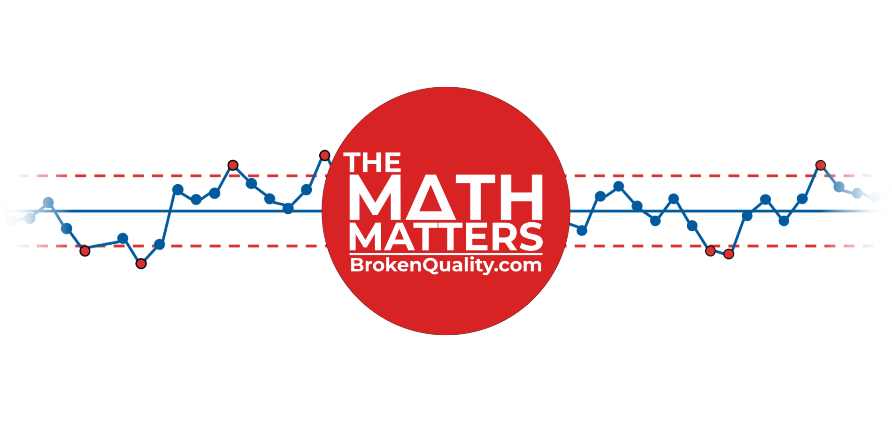
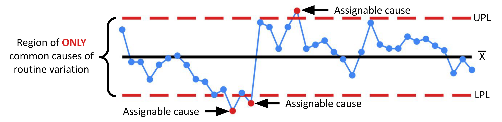

# The Math Matters

This repository contains the Python code and supporting files used to reproduce select figures for the essay published by the **The Math Matters** newsletter.

To browse the existing publications, visit [The Math Matters](https://themathmatters.substack.com/).

## About The Math Matters

The Math Matters is where I (Jim Lehner) discuss the tools and techniques that make understanding variation possible. Chief among the tools discussed here is the process behavior chart (aka control charts). The process behavior chart is the only tool capable of discriminating between the two types of variation: common causes of routine variation and assignable causes of exceptional variation. As such, it is the only tool that allows us to anticipate the future based on the past.

Since, at its core, management is prediction, the ability to characterize and predict future process behavior (within limits) or take action before the train goes off the rails is invaluable. It ensures that when the economic viability of our processes is in doubt, the appropriate actions are taken before chaos ensues.

## Other Stuff

Want to learn more about reducing costs and improving the quality of manufactured products? Click the link below to visit The Broken Quality Initiative. There you will find books, essays, and other resources that explore how understanding variation is the key to manufacturing products of world-class quality.

[BrokenQuality.com](https://brokenquality.com/).