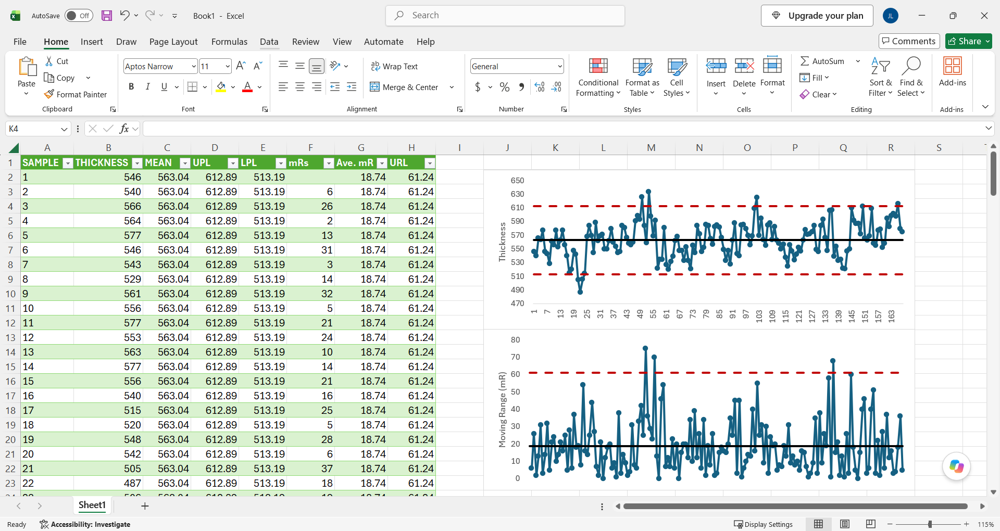

# How to Build an XmR Chart

This repository contains the Excel workbook, data, and other supporting files used in The Math Matters Essay **How to Build an XmR Chart (with Excel)**.

To read the full essay visit [The Math Matters](https://themathmatters.substack.com/).



## About the Essay

This essay outlines a 6 step process for constructing an XmR chart using Microsoft Excel.

The steps include:

1. Gather the data
2. Establish the spreadsheet structure
3. Calculate the moving ranges
4. Calculate the central lines
5. Calculate the process limits
6. Construct the XmR chart

The essay is practical. As such. readers are encouraged to follow along. Those who do will gain firsthand knowledge of how to construct an XmR chart in Excel.

## Repository Contents

The repository contains the Excel workbook and data used in the essay. A Jupyter Notebook that outlines how to construct the same XmR chart using Python is included in the notebooks folder.

```
├── README.md
├── data/
│   └── silicon-wafer-thickness.csv
├── equations/
├── excel/
│   └── silicon-wafer-thickness-workbook.xlsx
├── figures/
├── tables/
└── README.md
```