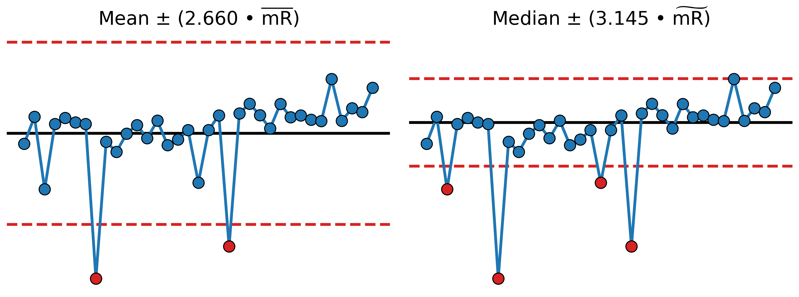

# Understanding Numerical Summaries, Part 1: Measures of Location

This repository contains the Python code and supporting files used to reproduce select figures for the essay **Understanding Numerical Summaries, Part 1: Measures of Location**.

To read the full essay visit [The Math Matters](https://themathmatters.substack.com/).



## About the Essay

This essay explores how different measures of dispersion are calculated and how those calculations can be used to understand variation using process behavior charts.   

- How the mean and median are calculated
- Conceptual differences between the mean and median
- The relationship between different measures of location and the calculation of process limits
- Why Walter A. Shewhart, the creator of the process behavior chart, decided to anchor his process limits to the mean instead of the median

## Repository Contents

The repository contains the Python code and data used to reproduce figures that are presented in the essay.

```
├── README.md
├── data/
│   ├── hydrix-cell-voltage.csv
│   └── piston-cylinder-outer-diameters.csv
├── notebooks/
│   └── numerical-summaries-part-1-measures-of-location.ipynb
└── figures/
    ├── fig_mean.png
    ├── fig_median.png
    ├── fig_mean_vs_median_process_limits.png
    └── fig_piston_cylinder_xmr_chart.png
```